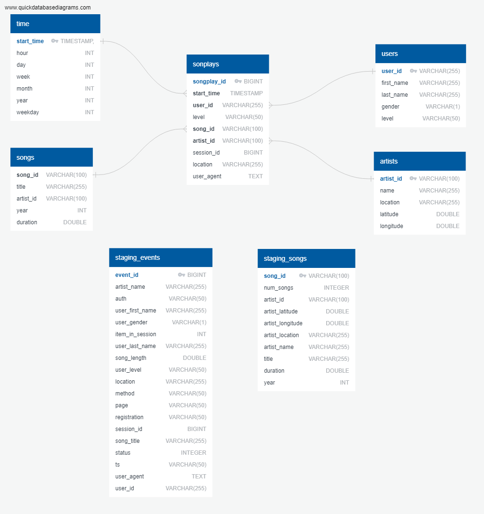

# Project 3: Song Play Analysis With S3 and Redshift
# Sebastian Baeza - August 2019

## Summary
* [Intro](#Intro)
* [Database Schema](#Databse-Schema)
* [Running the process](#Running-the-process)
* [Project structure](#Project-structure)
--------------------------------------------

#### Intro

In the 3rd project, the central technology that we will use is Amazon Web Services,
specifically S3 for data storage and Amazon Redshift as our database engine.

More info:
[S3] (https://aws.amazon.com/en/s3/) (Data storage).  
[Redshift](https://aws.amazon.com/en/redshift/) 

Data sources come from 2 public "S3 buckets" provided by the Udacity Data Engineer course.
The first bucket contains data about songs and artists.  
The second bucket has data about actions triggered by users (song played in a specific time, etc.. ). 
The data from the buckets are JSON files. 

--------------------------------------------

#### Database Schema
This is the database schema of the project

A Star model can represent the schema  

The songplays table is our fact table and contains the foreign keys  
to our dimensional tables:

* time
* users
* songs
* artists

The two staging tables are loaded previously to load our fact table.
That is the reason why those tables are not connected with the fact table or between them.
That tables allow us to do the ETL process naturally because you have only to make queries to insert new data in the star schema.

--------------------------------------------

#### Running the process
As I wrote in a previous section of this document, we have JSON files that come from 2 S3 buckets.
The person that will execute this ETL, only needs to create an "AWS Redshift Cluster", and obviously, your cluster ready and running.

Second.
You need Python. 

<b> Additional info: </b>
I used a simple Amazon Redshift cluster, with one node ("dc2.large" when you create your cluster).

You need to create an "IAM Role" for authorization mechanism, with one policy attached to this IAM will be "AmazonS3ReadOnlyAccess".

More info about IAM Role: https://docs.aws.amazon.com/en_us/IAM/latest/UserGuide/id_roles.html

More info about the policy: https://aws.amazon.com/en/blogs/security/organize-your-permissions-by-using-separate-managed-policies/

Then, you will need to open a terminal session, go with your prompt to the root folder, and  insert the following commands to run the ETL:  
The first command drop and create the tables 
``python create_tables.py``  

The second command will execute our ETL process  
`` python etl.py``  

With a one-node cluster, the process takes about 10 to 13 minutes to run entirely.
With two nodes cluster, the process takes 7 minutes.

--------------------------------------------

#### Project structure

The project contains the following files in the root folder ("/"): 

* <b> sql_queries.py </b> - This script contains all the queries, the "drop queries" for drop tables before the load process starts, the "create table" queries for creating all the tables that the process will use, and the "insert queries". The insert queries get data from staging tables and insert into our star schema. This script also contains the commands to get the data from the S3 buckets and insert this data into our staging tables.

* <b> create_tables.py </b>:  This script calls the queries from sql_queries.py, first use the "drop table" commands, and then the "create table" queries. 

* <b> etl.py </b> - This script executes the process to get and insert data in our star schema. First, run the commands to insert data in the staging tables (from S3 buckets) and then execute the "insert queries" to fill the tables in the star schema. 

* <b> dhw.cfg </b> - This is the configuration file that contains the string of the host, user, password, port, database name of the redshift cluster. Also includes the address of the S3 buckets and the "IAM Role".

* <b> /img </b> - This is a sub-folder that contains all images in use for the project. In this case, there is only one image file.

--------------------------------------------